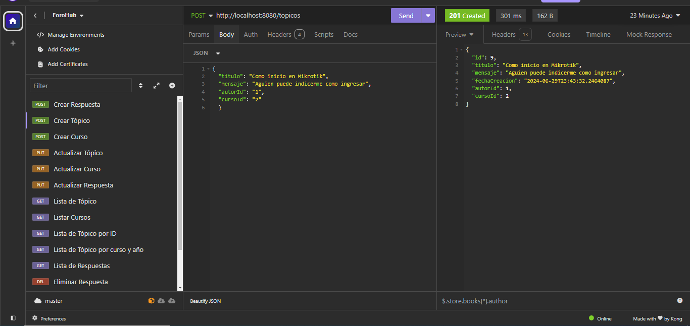
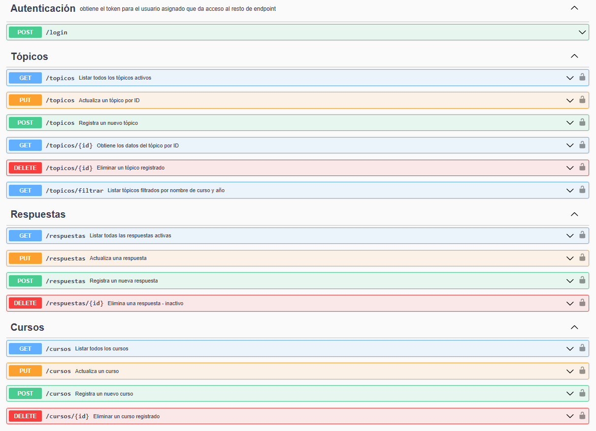

# API ForoHub

API ForoHub es una API REST para la gestión de tópicos, respuestas y cursos en un foro. Proporciona endpoints para crear, actualizar, listar y eliminar tópicos, respuestas y cursos, así como para filtrar tópicos según diferentes criterios.

## Características

- **Gestión de Tópicos**: Crear, actualizar, listar y eliminar tópicos.
- **Gestión de Respuestas**: Crear, actualizar, listar y eliminar tópicos.
- **Gestión de Cursos**: Crear, actualizar, listar y eliminar cursos.
- **Filtrado Avanzado**: Filtrar tópicos por nombre de curso y año.
- **Paginación**: Soporte completo para paginación en listados de tópicos y cursos.
- **Validaciones**: Validaciones de negocio y de integridad para evitar duplicados y entradas inválidas.

## Tecnologías Utilizadas

- **Java 17**
- **Spring Boot 3.0**
- **Spring Data JPA**
- **Hibernate**
- **Maven**
- **Swagger/OpenAPI**: Para la documentación interactiva de la API.
- **Lombok**: Para reducir el código boilerplate.
- **Jakarta Validation**: Para las validaciones de los modelos.

## Instalación

1. **Clonar el repositorio**:
   ```bash
   git clone https://github.com/tu-usuario/api-forohub.git
   cd api-forohub

1. **Configurar la base de datos**:

- **El proyecto está configurado para usar una base de datos H2 en memoria para desarrollo.**
- **Puedes cambiar la configuración en el archivo `src/main/resources/application.properties` si prefieres usar otra base de datos.**

3. **Compilar y ejecutar la aplicación**:
```bash
mvn clean install
mvn spring-boot:run
```

4. **Acceder a la documentación de la API**:
- **La documentación interactiva de la API estará disponible en: `http://localhost:8080/swagger-ui.html`**

## Uso

### Endpoints de Tópicos

- **Registrar un nuevo tópico**:
  ```http
  POST /topicos
  Contenido-Tipo: application/json

  {
    "titulo": "Título del tópico",
    "mensaje": "Mensaje del tópico",
    "autorId": "1",
    "cursoId": "2"
  }

- **Listar todos los tópicos activos**:

```http
GET /topicos
```

- **Actualizar un tópico**:

```http
PUT /topicos
Contenido-Tipo: application/json

{
  "id": "1",
  "titulo": "Título actualizado",
  "mensaje": "Mensaje actualizado"
}
```

- **Eliminar un tópico (borrado lógico)**:

```http
DELETE /topicos/{id}
```

- **Filtrar tópicos por nombre de curso y año**:

```http
GET /topicos/filtrar?cursoNombre=Java&year=2024
```

### Endpoints de Cursos

- **Registrar un nuevo curso**:

```http
POST /cursos
Contenido-Tipo: application/json

{
  "nombre": "Nombre del curso",
  "categoria": "Categoría del curso"
}
```
- **Listar todos los cursos**:

```http
GET /cursos
```

- **Actualizar un curso**:

```http
PUT /cursos
Contenido-Tipo: application/json

{
  "id": "1",
  "nombre": "Nombre del curso actualizado",
  "categoria": "Categoría del curso actualizada"
}
```

- **Eliminar un curso (borrado lógico)**:

```http
DELETE /cursos/{id}
```
## Capturas de Pantalla

### Registro de Tópico


### Listado de Gestiones


## Autor
<p>&copy Omar José Dávila Flores 
            <a href="https://www.linkedin.com/in/omar-jose-davila"></a></p>

